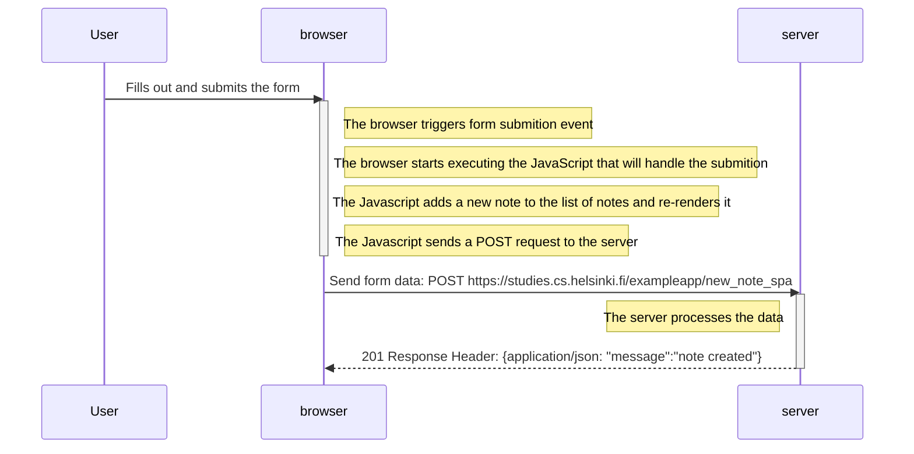

```mermaid
sequenceDiagram
  participant User
  participant browser
  participant server

  User->>browser: Fills out and submits the form

  activate browser
  Note right of browser: The browser triggers form submition event
  Note right of browser: The browser starts executing the JavaScript that will handle the submition
  Note right of browser: The Javascript adds a new note to the list of notes and re-renders it
  Note right of browser: The Javascript sends a POST request to the server
  deactivate browser

  browser->>server: Send form data: POST https://studies.cs.helsinki.fi/exampleapp/new_note_spa
  activate server
  Note left of server: The server processes the data
  server-->>browser: 201 Response Header: {application/json: "message":"note created"}
  deactivate server

```